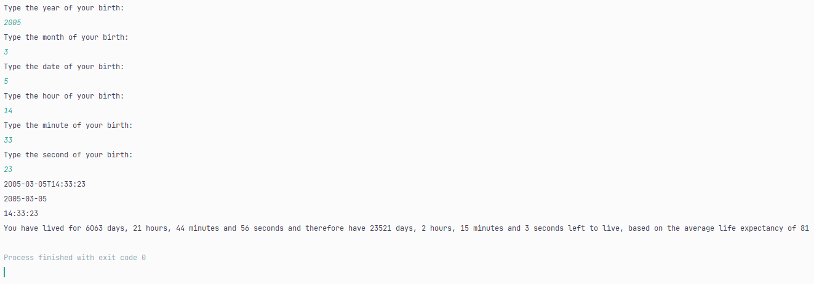

# remainingTimeAliveCalculator
Calculates the predicted time of death and how long the user has left to live, based on the user's moment of birth and an average life expectancy of 81 years.
Test Case:

